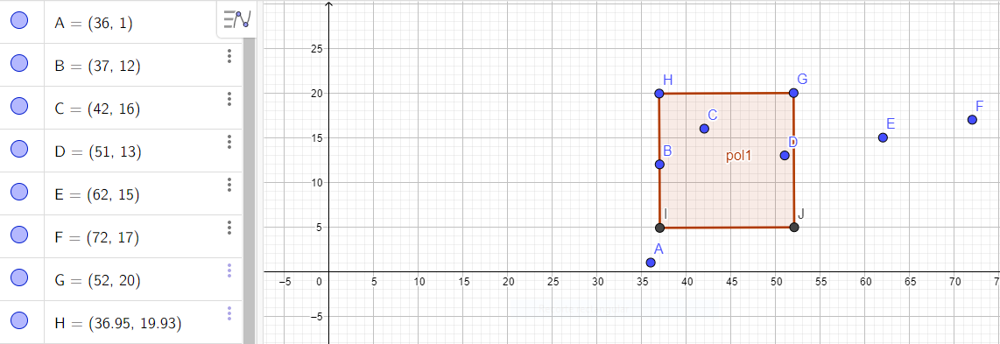

# Range Tree

**Integrantes:**
- Piero Morales
- Roosevelt Ubaldo

## Ejecución

Para probar los experimentos que se encuentran en el archivo [experimentos.cpp](experimentos.cpp), se debe ejecutar el siguiente comando.

```
❯ g++ -std=c++17 -Wall source/experimentos.cpp
❯ ./a.out
```
Por defecte los resultados se muestran de manera no verbosa, si desea ver cada uno de los resultados realice el siguiente cambio `bool verbose_result = true;` en [experimentos.cpp](experimentos.cpp).
Los resultados de las consultas realizadas durante la experimentación con 100k puntos insertados de manera aleatoria se encuentran en la carpeta [results](/results).

**Tiempo de ejecución de consultas:**

```
Build Range Tree of size: 100000 Time Taken: 0.977886
Query size: 10 Time Taken: 0.016039
Query size: 100 Time Taken: 0.129882
Query size: 1000 Time Taken: 1.69568
Query size: 10000 Time Taken: 17.06897
```

## Ejemplo de query

Un ejemplo de como se usan las queries se encuentra dentro del archivo [main.cpp](main.cpp)

